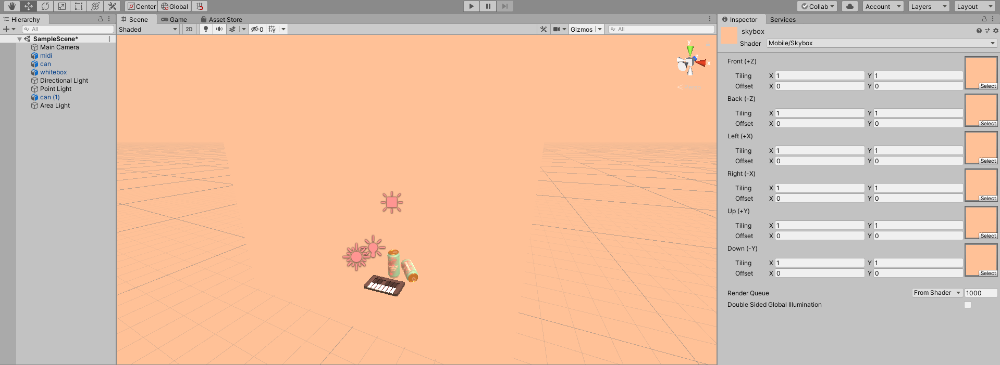
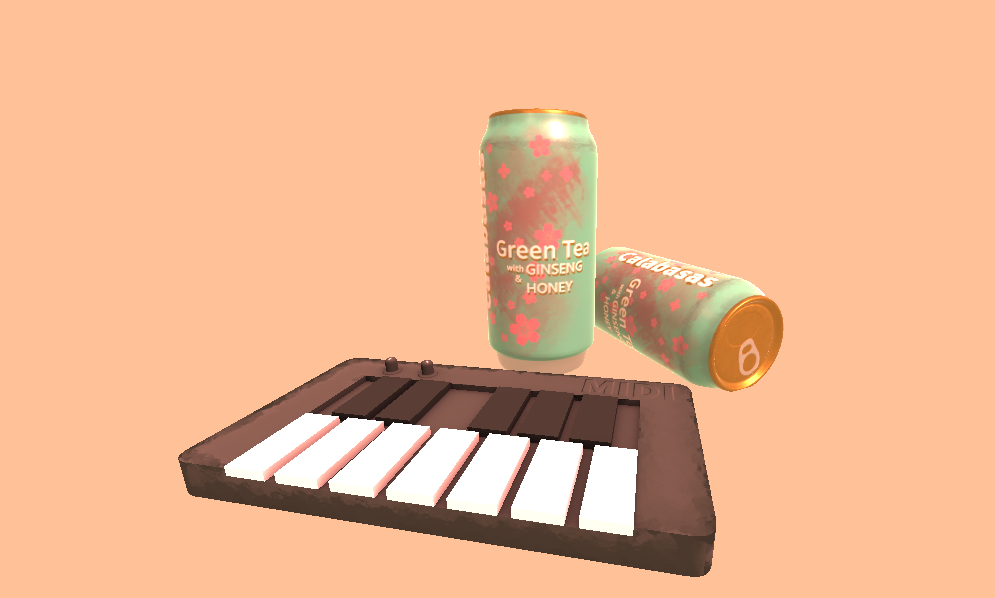
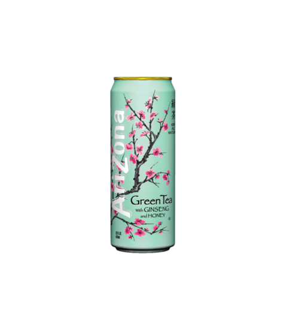
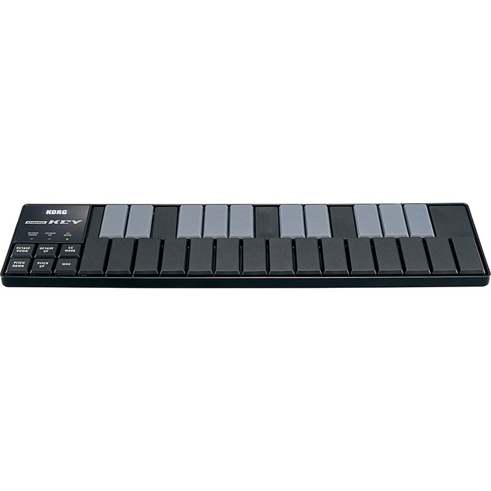

# CMPM163Labs

# Lab 2
Part 1

Video: https://drive.google.com/open?id=1pHjIfMwcSaKnZgh_8wliRBNV73j2GkwY

Mirror: https://youtu.be/ZNoIP1VIKco

~~~~
Part 2
~~~~

# Lab 3
Video: https://drive.google.com/open?id=176eJN8Fe1Zb71pAbHAuOw5bmYshQ8SVG

Mirror: https://youtu.be/yGHW-Fe2QT0
~~~~
North: custom shader, interpolates between white and teal
South: default normal shader
East: custom shader, interpolates between orange and grayish-blue
West: custom shader, interpolates between brown and green
~~~~

# Lab 4
Video: https://drive.google.com/open?id=17EWkCJyN-X6XrQUEj3OytOgIXZQw0WEF

Mirror: https://youtu.be/2GOWdllYEuI
~~~~
Top left: 
Custom shader, created per lab instructions
Middle left: 
Standard, plain texture
Middle center: 
Standard, texture and normal map
Middle right: 
Standard, texture and a normal map for a different albedo
Bottom right: 
Custom tiling shader, which has the original texture scaled down and tiled into a 2x2 grid. I used the fragment shader for scaling and the vertex shader for tiling.

24A:
x = 7u
24B:
y = 7v
24C:
gray
~~~~

# Lab 5
Video: https://drive.google.com/open?id=1E2D1Droz08mdIpIx60KIMOkzRNVtu0YW

Mirror: https://youtu.be/ShAw4LdO9tw
~~~~
A mod of the Unity kart demo. I created a custom car model with materials, a cactus model with materials, changed the skybox to have two (NSEWBottom + top) custom materials, and implemented a particle effect to simulate sand hitting the camera.
~~~~

# Lab 6

~~~~
Scene view
~~~~

~~~~
Definitions:
DFN Point Light:
Light is spherically emitted to a specified distance from the point light's position in 3D space. Similar to the light of a light bulb, distributes light evenly.

DFN Spot Light:
Light is conically emitted at a specified angle to a specified distance from the spot light's position in 3D space. Similar to the light of a spot light, distributes light in a beam.

DFN Directional Light:
Light is emitted at a specified angle from the overhead skybox, dependent on the directional light's rotation in 3D space. Similar to the light of the sun, distributes light across the world space.

DFN Area Light:
Light is rectangularly emitted at a specified angle to a specified distance from the area light's position in 3D space. Similar to a square overhead light.
~~~~

~~~~
Render
~~~~
The skybox was a simple pale pink texture, which I did to go for a lo-fi, vaporwave aesthetic. I simply created a pink texture and set it as the up/down/front/back/left/right.

~~~~
Exhibit A. "Arizona Iced Tea" inspired beverage
~~~~
I used 3DS Max to model the original mesh, which was essentially a turbosmoothed cylinder. I then exported the mesh to Substance Painter, where I created masks to distinguish different materials on the mesh: two kinds of aluminum and a glossy paper. I then drew the art and normal details and exported the materials to Unity. The model features an Albedo, Metallic, and Normal map.

~~~~
Exhibit B. "Korg MIDI Controller" inspired MIDI keyboard
~~~~
I used 3DS Max to model the original mesh, which was essentially a rectangular prism. Additionally, I subdivided the correct number of white and black keys on the piano. I then exported the mesh to Substance Painter, where I created masks to distinguish different materials on the mesh: two kinds of plastic and a dull rubber. I then drew the art itself and exported the materials to Unity. The model features an Albedo, Occlusion and two Normal maps.
